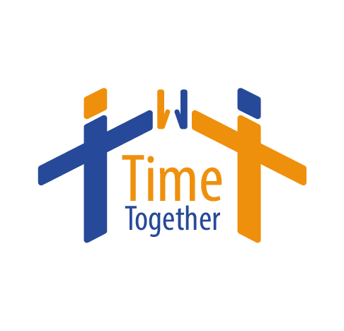

# TimeTogether API

  

## Descripción
TimeTogether es una APP totalmente gratuita diseñada para facilitar la gestión de eventos, grupos y la interacción entre usuarios. Permite a los usuarios registrarse, unirse a grupos, crear y participar en eventos, y mantener una lista de amigos.

## Contacto

|  |  |  |  |  |
|:---:|:---:|:---:|:---:|:---:|
| Hugo Estellés | Carlos Asensi | Oscar Mercado | Elisabeth López | Tomás Chiva |
|:---:|:---:|:---:|:---:|:---:|
| [Correo](mailto:huesga@floridauniversitaria.es) | [Correo 2](mailto:usuario2@example.com) | [Correo 3](mailto:usuario3@example.com) | [Correo 4](mailto:usuario4@example.com) | [Correo 5](mailto:usuario5@example.com) |
